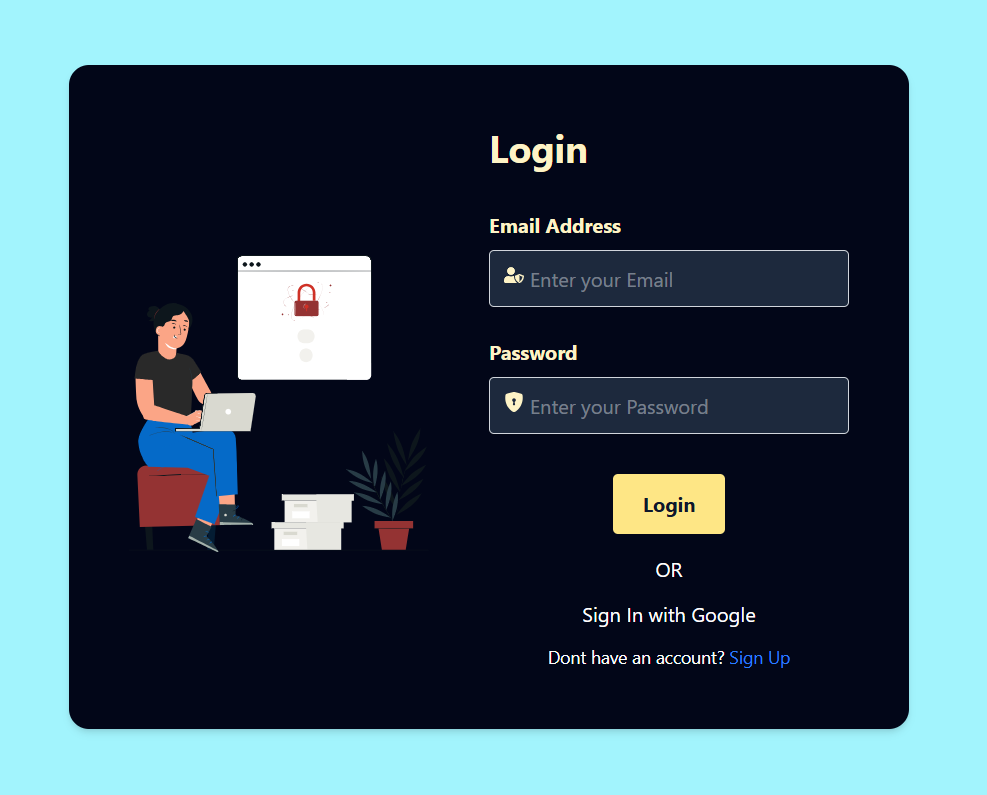
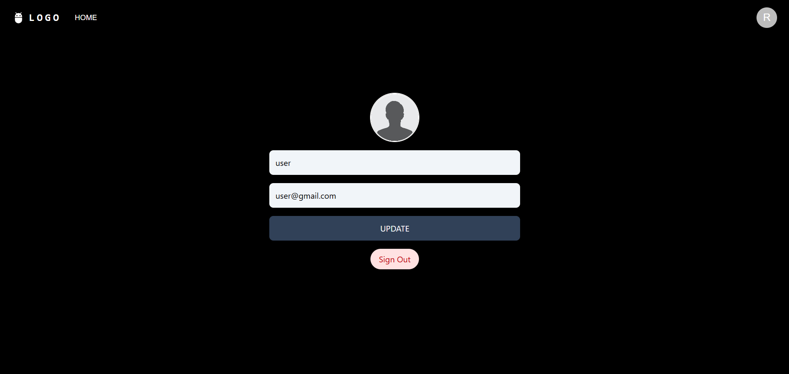

# **User Management System with Role-Based Access Control**

A web application that provides secure authentication, role-based access control (RBAC), and user management functionalities. Users can register, log in, and update their profiles, while administrators can manage users and perform CRUD operations.

## **Demo Screenshots**  

  
  
  
  

## **Demo Video** 

## **Features**  
✅ **User Authentication** (Sign Up, Login, Logout, Password Hashing)  
✅ **Role-Based Access Control (RBAC)** (Admin & User Permissions)  
✅ **User Profile Management** (Update Info, Change Password)  
✅ **Admin Dashboard** (CRUD Operations for Users)  
✅ **Secure API** with JWT Authentication  
✅ **Error Handling & Validation**

## **Technologies Used** 

### **Frontend**  
- React  
- Redux  
- Lottie Animation  
- React Hot Toast 

### **Backend**  
- Node.js (Express.js) 

### **Database**  
- MongoDB  

## **Installation & Setup**  

### **1. Clone the repository**  

https://github.com/aleexxii/Fullstack-Application.git
cd Fullstack-Application
cd frontend && npm install
cd ../backend && npm install

npm i

Set up environment variables
Create a .env file in the root directory of both folder add
frontend 
VITE_API_BASE_URL= http://localhost:7000
backend
PORT = 7000
JWT_SECRET = your secret key

JWT_REFRESH_SECRET = secret key

MONGO_URI = your mongodb link

FRONTEND_URL = http://localhost:5173

Run the application
# Start backend
cd backend
npm run dev

# Start frontend
cd frontend
npm run dev

Contribution

Contributions are welcome! If you’d like to contribute, please:

Fork the repository
Create a new branch (feature-branch-name)
Make changes and commit
Submit a pull request

contact
Email : amalexxii@gmail.com
LinkedIn : www.linkedin.com/in/i-am-rahul-p